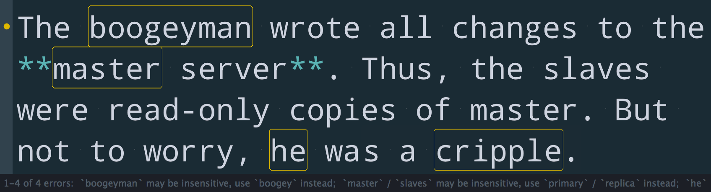

# SublimeLinter-contrib-alex



This linter plugin for [SublimeLinter][docs] provides an interface to [Alex](http://alexjs.com). It will be used with files that have the "plain text" & "markdown" syntax.


## Install

SublimeLinter 3 must be installed in order to use this plugin. If SublimeLinter 3 is not installed, please follow the instructions [here][installation].

### Linter install

Before using this plugin, you must ensure that Alex is installed on your system. To install Alex, do the following:

1. Install [Node.js](http://nodejs.org) (and [npm](https://github.com/joyent/node/wiki/Installing-Node.js-via-package-manager) on Linux).

1. Install Alex by typing the following in a terminal:

```
$ npm install --global alex
```

1. If you are using `nvm` and `zsh`, ensure that the line to load `nvm` is in `.zshenv` and not `.zshrc`.

1. If you are using `zsh` and `oh-my-zsh`, do not load the `nvm` plugin for `oh-my-zsh`.

### Linter configuration

In order for Alex to be executed by SublimeLinter, you must ensure that its path is available to SublimeLinter. Before going any further, please read and follow the steps in ["Finding a linter executable"](http://sublimelinter.readthedocs.org/en/latest/troubleshooting.html#finding-a-linter-executable) through "Validating your PATH" in the documentation.

Once you have installed and configured Alex, you can proceed to install the `SublimeLinter-contrib-alex` plugin if it is not yet installed.

### Plugin install

Please use [Package Control][pc] to install the linter plugin. This will ensure that the plugin will be updated when new versions are available. If you want to install from source so you can modify the source code, you probably know what you are doing so we won't cover that here.

To install via Package Control, do the following:

1. Within Sublime Text, bring up the [Command Palette][cmd] and type `install`. Among the commands you should see `Package Control: Install Package`. If that command is not highlighted, use the keyboard or mouse to select it. There will be a pause of a few seconds while Package Control fetches the list of available plugins.

1. When the plugin list appears, type `alex`. Among the entries you should see `SublimeLinter-contrib-alex`. If that entry is not highlighted, use the keyboard or mouse to select it.

## Settings

For general information on how SublimeLinter works with settings, please see [Settings][settings]. For information on generic linter settings, please see [Linter Settings][linter-settings].


## License

MIT © [Sindre Sorhus](http://sindresorhus.com)


[docs]: http://sublimelinter.readthedocs.org
[installation]: http://sublimelinter.readthedocs.org/en/latest/installation.html
[locating-executables]: http://sublimelinter.readthedocs.org/en/latest/usage.html#how-linter-executables-are-located
[pc]: https://packagecontrol.io/installation
[cmd]: http://docs.sublimetext.info/en/sublime-text-3/extensibility/command_palette.html
[settings]: http://sublimelinter.readthedocs.org/en/latest/settings.html
[linter-settings]: http://sublimelinter.readthedocs.org/en/latest/linter_settings.html
[inline-settings]: http://sublimelinter.readthedocs.org/en/latest/settings.html#inline-settings
